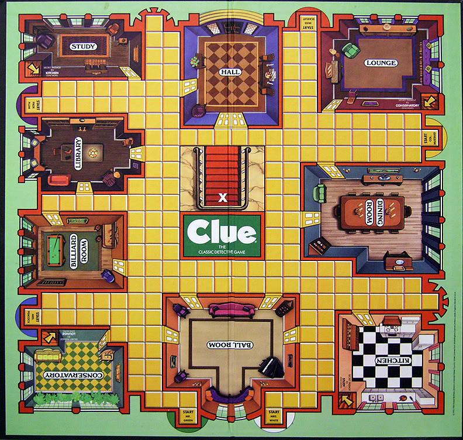

# Clue

This is a SWI-Prolog script that poses as one of the players on a match of [Clue](http://www.hasbro.com/en-us/toys-games/hasbro-games:clue), by Hasbro. It was implemented based on the [rules](clue_hasbro_2002.pdf) of the 2002 version of the game and the following board:

The script basically provides predicates to start a game, inform another player's action and request the next action. The state of the game is stored as assertions.

Please check de [documentation](doc/doc.pdf) for a detailed explanation of the implementation and use.
